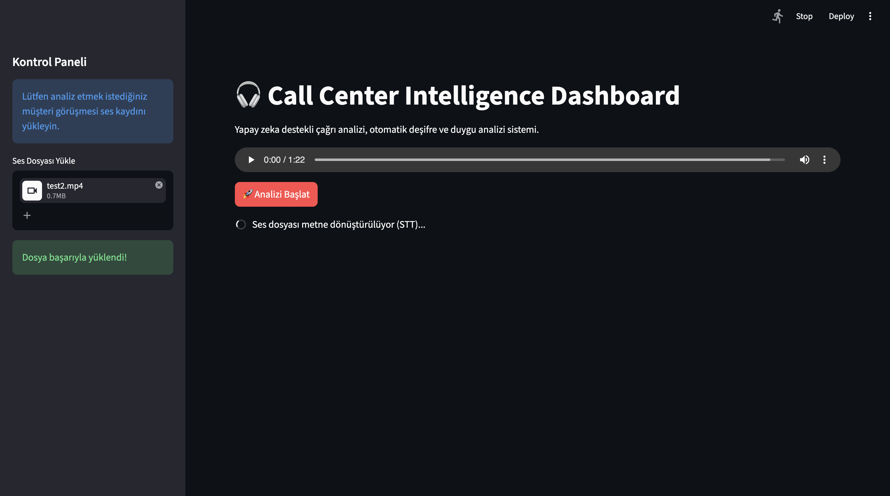
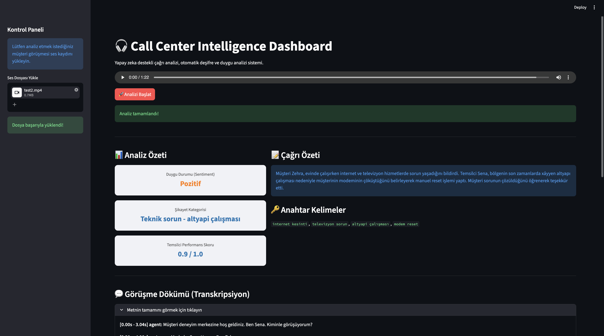
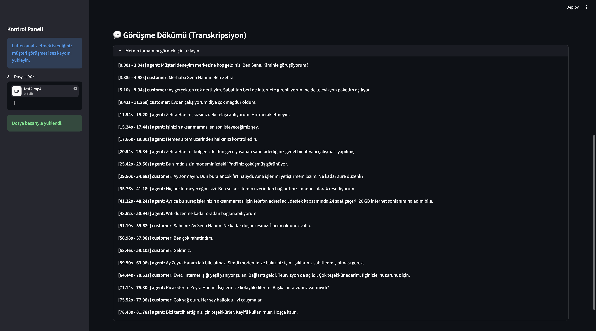
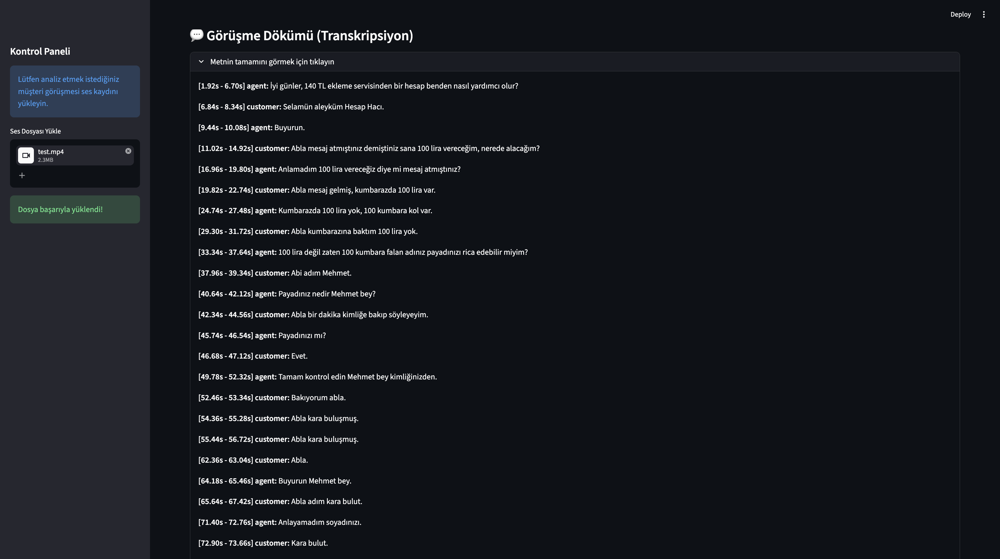

# 🎧 Call Center Intelligence System


**Call Center Intelligence System**, müşteri hizmetleri görüşmelerini tamamen otonom bir şekilde yazıya döken (Speech-to-Text), konuşmacıları ayrıştıran (Diarization) ve yerel bir Büyük Dil Modeli (LLM) ile analiz eden yapay zeka destekli bir pipeline projesidir.

---

## 📌 Projenin Amacı

Müşteri hizmetleri operasyonlarında kalite kontrol süreçleri genellikle manuel, zaman alıcı ve maliyetlidir. Bu proje, ham ses kayıtlarını alarak saniyeler içerisinde:
- Görüşmenin deşifresini çıkarır.
- Müşterinin şikayet kategorisini ve duygu durumunu (sentiment) analiz eder.
- Görüşmenin kısa bir özetini oluşturur.
- Temsilci performansına otomatik olarak bir puan atar.

En büyük avantajı: **Tüm veriler yerel cihazınızda işlenir.** OpenAI API veya benzeri dış servisler kullanılmadığı için şirket/müşteri verileri dışarı sızmaz (100% Privacy).

---

## 📸 Ekran Görüntüleri

| STT Dönüşüm İşlemi | LLM Analiz İşlemi |
|:---:|:---:|
|  |  |
| **Pozitif Çağrı Örneği (Özet)** | **Negatif Çağrı Örneği (Özet)** |
|  |  |
| **Pozitif Çağrı Örneği (Transkript)** | **Negatif Çağrı Örneği (Transkript)** |
|  |  |

---

## 🛠️ Kullanılan Teknolojiler

Proje, modern ve yüksek performanslı açık kaynak kütüphaneler üzerine inşa edilmiştir:

- **Ses İşleme:** `pydub` (ses formatlama), `noisereduce` (gürültü azaltma - spectral gating), `NumPy` (ses matrisi işlemleri).
- **Speech-to-Text (STT):** `openai-whisper` (transkripsiyon).
- **Diarization:** `pyannote.audio` (konuşmacı ayrıştırma).
- **Dil Modeli (LLM):** `transformers` (HuggingFace), `peft` (LoRA adaptör yükleme), `torch` (PyTorch - CUDA/MPS destekli).
- **Model Eğitimi:** `unsloth` (hızlı fine-tuning), `trl` (SFTTrainer), `bitsandbytes` (4-bit quantization), `datasets` (veri işleme).
- **Arayüz:** `streamlit`.
- **Veri Doğrulama:** `pydantic` (veri sözleşmeleri).

---

## 📁 Proje Yapısı

```text
call-center-intelligence-system/
├── data/
│   ├── turkish_telecom_dataset.csv  # Çevrilmiş eğitim veri seti
│   ├── raw/                         # İşlenmemiş ham ses dosyaları
│   └── processed/                   # Ön işlemden geçmiş ses dosyaları
├── docs/assets/                     # Dokümantasyon görselleri
├── services/
│   ├── analysis/                    # LLM analizi ve model eğitimi
│   │   ├── models/                  # LoRA adaptörleri (llama3.2_3b_callcenter_model)
│   │   ├── training/                # Eğitim (fine-tuning) scriptleri ve veri seti
│   │   └── pipeline.py              # LLM analiz işlem borusu
│   ├── dashboard/                   # Streamlit web arayüzü
│   ├── retrieval/                   # (Planlanan) RAG tabanlı bilgi getirme servisi
│   └── transcription/               # STT, Diarization ve Ses Ön İşleme
│       ├── diarizer.py              # Konuşmacı ayrıştırma (Pyannote)
│       ├── preprocessor.py          # Gürültü azaltma ve format dönüştürme
│       └── pipeline.py              # STT işlem borusu
├── shared/
│   ├── contracts.py                 # Pydantic veri modelleri (STTOutput, Utterance)
│   └── mock_data/                   # Test ve geliştirme için örnek veriler
├── .env.example                     # Çevre değişkenleri şablonu
└── README.md                        # Proje dokümantasyonu
```

---

## 🧠 Nasıl Çalışır? (Pipeline Mimarisi)

Uygulama arka planda modüler bir yapıya sahiptir. Süreç şu şekilde işler:

### 1. Ses Ön İşleme (Preprocessing)
Sisteme yüklenen ses dosyaları (`.wav`, `.mp3`, `.m4a` vb.), `pydub` ve `noisereduce` kullanılarak işlenir:
- Ses kanalları **mono** formata dönüştürülür.
- Örnekleme hızı (sample rate) **16kHz**'e sabitlenir.
- Spectral gating yöntemiyle arka plan gürültüsü temizlenir (noise reduction).

### 2. Metne Dönüştürme ve Diarization (STT)
- **OpenAI Whisper** kullanılarak ses metne dönüştürülür. (Not: Mac cihazlarda Whisper'ın kelime bazlı zaman damgaları MPS'i desteklemediğinden otomatik olarak CPU'ya geçiş yapılır).
- **Pyannote Audio** ile Müşteri ve Temsilci sesleri birbirinden ayrıştırılır (Diarization).
- Ham ses dosyası üzerinden **desibel (dB) seviyeleri** analiz edilir. LLM, müşterinin bağırdığını veya sessizleştiğini bu sayede algılayabilir.
- Çıktılar `shared/contracts.py` içerisindeki Pydantic veri sözleşmelerine (Data Contracts) uygun olarak yapılandırılır.

### 3. Yapay Zeka Analizi (LLM)
- Transkript, zaman damgaları ve dB değerleriyle formatlanıp **Llama-3.2-3B-Instruct** modeline beslenir.
- Bellek optimizasyonu için model *Singleton* tasarım deseniyle bellekte tutulur.
- Modelden dönen metin, hem **JSON ayrıştırma** hem de **fuzzy label matching (bulanık etiket eşleştirme)** yöntemleriyle akıllıca parse edilerek yapılandırılmış verilere (Duygu, Kategori, Skor, Özet vb.) dönüştürülür.

### 4. Retrieval Servisi (Gelecek Planı)
- İlerleyen aşamalarda `services/retrieval/` dizininde, RAG (Retrieval-Augmented Generation) altyapısıyla şirketin bilgi bankasından otomatik yanıt önerileri getirecek servis geliştirilecektir.

---

## 🎓 Model Eğitimi (Fine-Tuning)

Bu projenin zekası, modele çağrı merkezi görüşmelerini analiz etmesini öğreten özel bir eğitim (Fine-Tuning) sürecine dayanır:

1. **Veri Seti Hazırlığı:** `Ming-secludy/telecom-customer-support-synthetic-replicas` veri seti Llama 3 ile `data_prep.py` kullanılarak Türkçeye çevrildi (`data/turkish_telecom_dataset.csv`).
2. **Dinamik Ses Seviyeleri (dB):** `dataset_formatter.py` ile metindeki duygu ifadelerine göre (ör: "iptal", "!", "...") gerçeğe yakın desibel değerleri sentetik olarak üretildi.
3. **Eğitim (LoRA & Unsloth):** `training/train.py` scripti kullanılarak Llama-3.2-3B-Instruct modeline Unsloth framework'ü ile **LoRA** (Low-Rank Adaptation) uygulandı. Model 4-bit quantization ile bellek dostu bir şekilde eğitildi.
4. **Adaptör Kullanımı:** Eğitilen modelin ağırlıkları (`services/analysis/models/llama3.2_3b_callcenter_model` içinde ~48MB) inferans sırasında ana modelin üzerine bindirilerek çalışır. (HuggingFace'den indirilecek ana model ~6GB VRAM/RAM gerektirir).

---

## 💻 Kurulum Adımları (Adım Adım)

Projeyi bilgisayarınızda (local) çalıştırmak için donanım gereksinimleri ve kurulum adımları aşağıdadır.

### Donanım Gereksinimleri
- **İşlemci:** Apple Silicon (M1/M2/M3) veya CUDA Destekli Nvidia GPU (Ya da güçlü bir CPU)
- **Bellek:** Minimum 8GB (Önerilen 16GB RAM) LLM ve STT modelinin belleğe yüklenebilmesi için.
- **Disk:** Yaklaşık 10GB boş alan (Modeller ve bağımlılıklar için)

### Diğer Gereksinimler
- **Python 3.11 veya üzeri**
- **FFmpeg** (Ses işleme kütüphaneleri için sistemde yüklü olmalıdır. Mac'te: `brew install ffmpeg`)

### 1. Repoyu Klonlayın

```bash
git clone https://github.com/elifsenasoysal/call-center-intelligence-system.git
cd call-center-intelligence-system
```
*(Not: Llama 3 modeli için eğitilmiş LoRA adaptörleri (~48MB) repoya dahil edilmiştir. Modelin temel ağırlıkları (~6GB) uygulama ilk çalıştığında otomatik indirilecektir.)*

### 2. Sanal Ortam (Virtual Environment) Oluşturun

Python paketlerinin sisteminizi kirletmemesi için sanal ortam kurmak şarttır:

```bash
# Sanal ortamı oluşturun
python3 -m venv .venv

# Sanal ortamı aktif edin (Mac/Linux için)
source .venv/bin/activate

# Windows kullanıyorsanız:
# .venv\Scripts\activate
```

### 3. Bağımlılıkları Yükleyin

Projedeki her servisin kendi gereksinimleri bulunmaktadır. Kurulumları sırasıyla başlatın:

```bash
# 1. Ses ve transkript kütüphaneleri
pip install -r services/transcription/requirements.txt

# 2. LLM, model ve Torch kütüphaneleri
pip install -r services/analysis/requirements.txt

# 3. Web arayüzü kütüphaneleri
pip install -r services/dashboard/requirements.txt
```
*(Apple Silicon - M1/M2/M3 kullanan Mac cihazlarda PyTorch `mps` donanım hızlandırması, Windows/Linux'ta ise `cuda` donanım hızlandırması kod içerisinde otomatik olarak algılanıp aktif edilecektir.)*

### 4. Ortam Değişkenlerini (Environment Variables) Ayarlayın

Diarization işlemini yapabilmek için Pyannote modellerini kullanmamız gerekiyor. Bunun için HuggingFace erişim token'ına (ücretsiz) ihtiyacınız var.

1. Ana dizinde bulunan `.env.example` dosyasının adını `.env` olarak değiştirin.
2. Dosyanın içini açıp aşağıdaki gibi düzenleyin:

```env
# .env dosyası
HUGGINGFACE_TOKEN=hf_sizin_tokeniniz_buraya_gelecek
WHISPER_MODEL_SIZE=large-v3

```

> **ÖNEMLİ:** HuggingFace token'ı almak için [HuggingFace Settings](https://huggingface.co/settings/tokens) adresini ziyaret edebilirsiniz. Token'ı kullanabilmek için [pyannote/speaker-diarization-3.1](https://huggingface.co/pyannote/speaker-diarization-3.1) ve [pyannote/segmentation-3.0](https://huggingface.co/pyannote/segmentation-3.0) sayfalarındaki "Kullanım Şartları"nı (Terms of Use) onaylamanız gerekmektedir.

---

## 🚀 Uygulamayı Çalıştırma

Tüm kurulumları tamamladıktan ve sanal ortamınız `.venv` aktifken, arayüzü başlatmak için şu komutu çalıştırın:

```bash
streamlit run services/dashboard/app.py
```

Bu komut, varsayılan web tarayıcınızda (genellikle `http://localhost:8501`) Dashboard'u açacaktır. Arayüzden bir ses dosyası yükleyip "Analizi Başlat" butonuna tıklamanız yeterlidir.
